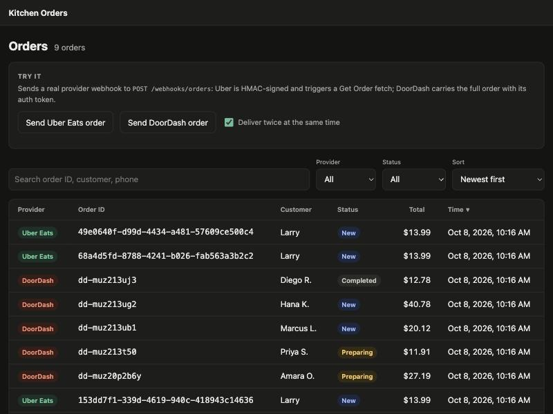
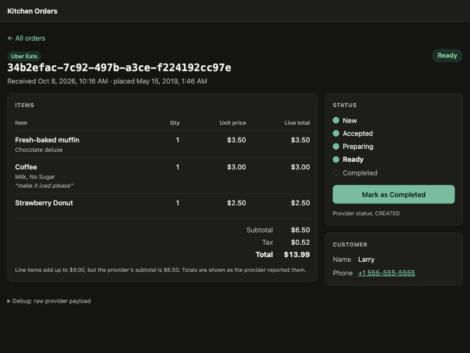
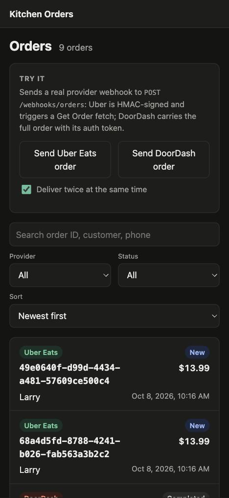

# Marketplace Orders

Uber Eats and DoorDash orders arrive at **one webhook endpoint** and become **one internal kitchen ticket**, viewable and progressed in a small admin.

**Live demo**

- Admin: **ADMIN_URL**
- API: **API_URL** (`POST /webhooks/orders`)

The API runs on a free tier that sleeps when idle, so the first request can take up to a minute. In the admin, the **Try it** panel sends real, signed provider webhooks through the endpoint. Tick *Deliver twice at the same time* to watch two identical deliveries produce one order.

| Orders | Order detail | 390 px |
|---|---|---|
|  |  |  |

```
api/        Express + TypeScript + Postgres (pg). Webhook, orders API, migrations, tests.
admin/      Next.js (App Router). Order list and detail.
fixtures/   Official provider samples — verbatim (as-published/) and minimally corrected JSON.
```

## Run it

Requirements: Node 20+, Postgres 16 (Docker or local).

```bash
npm install
docker compose up -d db              # Postgres on :5432, creates marketplace_orders + marketplace_orders_test
cp api/.env.example api/.env         # using a local Postgres instead? edit DATABASE_URL / TEST_DATABASE_URL
npm run migrate
npm run dev:api                      # http://localhost:4000
npm run dev:admin                    # http://localhost:3000 (second terminal)
```

Optional, to populate the admin with a few varied orders sent through the real webhook:

```bash
npm run samples -w api
```

Tests (need the test database from above):

```bash
npm test
```

There is no live Uber account, so with `MOCK_UBER=1` the API mounts a stand-in for Uber's Get Order at `/mock/uber/v2/eats/order/:id` and `UBER_API_BASE` points at it. The webhook handler still makes a real HTTP call with a Bearer token; point `UBER_API_BASE` at `https://api.uber.com` and set `UBER_ACCESS_TOKEN` to use the real API.

## One curl per provider

Both hit the same endpoint. Run from the repo root with the API on :4000 and the defaults from `.env.example`.

**Uber Eats** — signature is HMAC-SHA256 of the exact body bytes, keyed with the client secret, lowercase hex:

```bash
SIG=$(openssl dgst -sha256 -hmac "dev-uber-client-secret" fixtures/uber/webhook.orders-notification.json | awk '{print $NF}')
curl -i -X POST http://localhost:4000/webhooks/orders \
  -H "Content-Type: application/json" \
  -H "X-Uber-Signature: $SIG" \
  --data-binary @fixtures/uber/webhook.orders-notification.json
# HTTP/1.1 200 OK   (empty body)
```

**DoorDash** — the token configured on the webhook subscription, sent in `Authorization`:

```bash
curl -i -X POST http://localhost:4000/webhooks/orders \
  -H "Content-Type: application/json" \
  -H "Authorization: dev-doordash-token" \
  --data-binary @fixtures/doordash/webhook.order-create.json
# HTTP/1.1 200 OK
# {"merchant_supplied_id":"<internal order id>","order_status":"success"}
```

Send either one twice: still one order.

**Against the live demo:** the same commands work with the demo credentials from `render.yaml`. These are published on purpose so reviewers can try it; real credentials would live in a secret store.

```bash
API=API_URL
SIG=$(openssl dgst -sha256 -hmac "demo-uber-client-secret" fixtures/uber/webhook.orders-notification.json | awk '{print $NF}')
curl -i -X POST $API/webhooks/orders -H "Content-Type: application/json" -H "X-Uber-Signature: $SIG" --data-binary @fixtures/uber/webhook.orders-notification.json
curl -i -X POST $API/webhooks/orders -H "Content-Type: application/json" -H "Authorization: demo-doordash-token" --data-binary @fixtures/doordash/webhook.order-create.json
```

## How the endpoint works

`POST /webhooks/orders`

1. **Read the raw body.** `express.raw` on this route only — Uber's signature is over the exact bytes, so the body must not be parsed and re-serialised before verification.
2. **Detect the provider from the body's shape** (`api/src/webhooks/detect.ts`). Query parameters and any `provider` field are ignored.
   - Uber: `event_type` starts with `orders.` and `meta.resource_id` is a string.
   - DoorDash: `event.type` is a string and `order` is an object.
   - Anything else → `400`.
3. **Authenticate the way that provider documents it.**
   - Uber: `X-Uber-Signature` must equal `hex(HMAC-SHA256(client_secret, raw_body))`. Constant-time compare. Bad/missing → `401`, and Uber's API is never called.
   - DoorDash: there is no request signing; the `Authorization` header must equal the Auth Token configured on the webhook subscription. Constant-time compare. Bad/missing → `401`.
4. **Follow the provider's flow.**
   - Uber: the notification has no cart. Call `GET /v2/eats/order/{meta.resource_id}`, check the returned `id` matches, map, upsert, reply **`200` with an empty body**. If Get Order fails the endpoint returns `502`; Uber retries non-2xx with exponential backoff (up to 7 attempts), and the upsert makes retries safe. The fetch is inline rather than queued (no queue in scope); Uber's acceptance window is 11.5 minutes, so a short synchronous fetch fits.
   - DoorDash: the webhook carries the full order. Map, upsert, and confirm **synchronously**: `200` with the same body as the async confirmation PATCH (`merchant_supplied_id`, `order_status: "success"`). A payload we can't use gets a non-2xx (`400`, `order_status: "fail"`, `failure_reason`), which DoorDash treats as a failed order. Async (`202` + `PATCH /api/v1/orders/{id}`) is the alternative; sync avoids needing DoorDash credentials for the follow-up call.
5. **Upsert** on the unique key `(provider, external_order_id)` with `INSERT … ON CONFLICT DO UPDATE`. The database serialises concurrent duplicates on the unique index, so there's no read-then-insert race. On update, status only moves forward (see below), so a late or redelivered webhook can't undo kitchen progress.

## Internal model

Table `orders` (`api/src/db/migrations/001_create_orders.sql`):

| Field | Notes |
|---|---|
| `id` | uuid, ours |
| `provider` | `uber_eats` \| `doordash` |
| `external_order_id` | provider's order id; unique together with `provider` |
| `status` | `new` → `accepted` → `preparing` → `ready` → `completed`; `cancelled` |
| `customer` | jsonb `{ name, phone, email }` |
| `line_items` | jsonb `[{ name, quantity, unit_price_cents, total_cents, modifiers[], notes }]` |
| `total_cents` | integer minor units |
| `currency` | ISO 4217 |
| `created_at` | when we first received the order |
| `raw_payload` | jsonb. Uber: `{ notification, order }` (webhook + Get Order). DoorDash: the webhook body |
| *extras* | `provider_status` (raw provider status, for debugging the mapping), `subtotal_cents`, `tax_cents`, `placed_at`, `updated_at` |

## Mapping table

| Internal | Uber Eats (Get Order v2 response) | DoorDash (`OrderCreate` webhook) |
|---|---|---|
| `provider` | detected: `event_type: "orders.*"` + `meta.resource_id` | detected: `event.type` + `order` |
| `external_order_id` | `id` (= webhook `meta.resource_id`) | `order.id` |
| `status` | `current_state` (see status table) | `event.status` (`NEW`) |
| `provider_status` | `current_state` | `event.status` |
| `customer.name` | `eater.first_name` (+ `eater.last_name` if present) | `order.consumer.first_name` + `last_name` |
| `customer.phone` | `eater.phone` | `order.consumer.phone` |
| `customer.email` | — (not in response) | `order.consumer.email` |
| `line_items[]` | `cart.items[]` | `order.categories[].items[]` (flattened) |
| `line_items[].name` | `title` | `name` |
| `line_items[].quantity` | `quantity` | `quantity` |
| `line_items[].unit_price_cents` | `price.unit_price.amount` (already includes modifiers) | `price` + Σ(option `price` × option `quantity`) over nested `extras[].options[]` (and their `extra[]`) |
| `line_items[].total_cents` | `price.total_price.amount` | `unit_price_cents × quantity` |
| `line_items[].modifiers` | `selected_modifier_groups[].selected_items[].title`; `removed_items[]` as "No …" | names from `extras[].options[]`, recursively |
| `line_items[].notes` | `special_instructions` | `special_instructions` |
| `subtotal_cents` | `payment.charges.sub_total.amount` | `order.subtotal` |
| `tax_cents` | `payment.charges.tax.amount` | `order.tax` |
| `total_cents` | `payment.charges.total.amount` | `order.subtotal + order.tax` |
| `currency` | `payment.charges.total.currency_code` | none in payload → `USD` |
| `placed_at` | `placed_at` | — |
| `created_at` | ours (`now()` on first insert) | ours |

### Status mapping

| Internal | Uber `current_state` | DoorDash |
|---|---|---|
| `new` | `CREATED`, `UNKNOWN` | `NEW` (every incoming order) |
| `accepted` | `ACCEPTED` | — (set in the admin) |
| `preparing` | — | — |
| `ready` | — | — |
| `completed` | `FINISHED` | — |
| `cancelled` | `DENIED`, `CANCELED` | (Order Canceled webhook — not implemented) |

Neither provider reports `preparing`/`ready`; those exist only in the kitchen and are set from the admin. Merge rule on upsert: `completed`/`cancelled` are final; an incoming `cancelled` always wins otherwise; any other incoming status applies only if it is further along the flow. Uber's webhook `meta.status` (`"pos"`) describes the webhook, not the order, and is not mapped.

## Conflicts log

What the brief's notes suggested vs. what the docs say, and what this repo does.

| Question | What the docs say | What I did |
|---|---|---|
| Does the Uber webhook include the cart? | **No.** `orders.notification` has only `event_type`, `event_id`, `event_time`, `meta { resource_id, status, user_id }`, `resource_href`. The order is fetched from `GET /v2/eats/order/{order_id}` (`eats.order` or `eats.store.orders.read` scope). | Webhook → signature check → Get Order → map → upsert. |
| Does DoorDash use a top-level `items[]`? | **No.** Items are at `order.categories[].items[]`; options nest as `extras[].options[]`, and options can nest again via `options[].extra[]`. | Flatten across categories; walk option nesting recursively. |
| Which DoorDash field is the total; is tax included? | **There is no total field.** The Order model has `subtotal` and `tax` as separate integers, so `subtotal` excludes tax. Also present: `merchant_tip_amount` (tip for staff), `tip_amount` (self-delivery only), `is_tax_remitted_by_doordash`, `tax_amount_remitted_by_doordash`. No currency field. | `total_cents = subtotal + tax`, tips excluded (this is a kitchen ticket); currency `USD`. |
| How is the Uber signature built; expected response? | `X-Uber-Signature` = HMAC-SHA256 of the request body keyed with the **client secret**, lowercase hex. Acknowledge with **`200` and an empty body**. Failed deliveries retry with exponential backoff, up to 7 attempts. | Verify on raw bytes, constant-time; `401` on mismatch; `200` + empty body on success. |
| How does DoorDash authenticate; expected response? | No HMAC. An Auth Token is configured on the webhook subscription in the Developer Portal and sent with each webhook in the Authorization header. Response: `200` = synchronous success (non-2xx = order failure, body same shape as async confirmation) **or** `202` then `PATCH /api/v1/orders/{id}` within 3–8 minutes. | Compare `Authorization` to `DOORDASH_WEBHOOK_TOKEN`; synchronous `200` + `{ merchant_supplied_id, order_status: "success" }`. |
| Does Uber `meta.resource_id` match the Get Order id? | **Yes per the docs** ("equivalent to the order_id"), and `resource_href` is the Get Order URL with that id. **But the official samples disagree:** webhook `153dd7f1-…`, Get Order `f9f363d1-…`. | Key on the Get Order `id` and reject (`502`) if it differs from `resource_id`. The mock returns the official sample with `id` set to the requested id so the two fixtures can be used together. |
| Where does DoorDash put the customer's phone? | `order.consumer.phone` (with `first_name`, `last_name`, `email`, `id`). `consumer.id` is documented as needing 64-bit integer support. | Read `consumer.phone`. `consumer.id` isn't used (would need bigint/string, not a JS number). |
| How should provider statuses map? | Uber `current_state`: `CREATED`, `ACCEPTED`, `DENIED`, `FINISHED`, `CANCELED`, `UNKNOWN`. DoorDash: all incoming orders are `event.status: "NEW"`; cancellations arrive on a separate Order Canceled webhook. | See status mapping. Forward-only merge so retries don't regress status. |

### Problems in the official samples

The brief asks for the official samples in `/fixtures`. Three are not valid JSON as published, so each is kept verbatim in `as-published/` and a minimally corrected `.json` sits next to it (only the listed fix applied):

| Sample | Problem | Fix in the `.json` |
|---|---|---|
| Uber `orders.notification` | Ends with a literal `...` placeholder | Removed the placeholder |
| Uber Get Order response | Trailing commas (`"first_name": "Larry",` before `}`, after the last cart item, etc.) | Removed trailing commas |
| DoorDash sample order | Missing comma after `"tax": 300` | Added the comma |
| DoorDash webhook | The guide shows the envelope `{ "event": { "type": "OrderCreate", "status": "NEW" }, "order": <Order> }`; the sample page shows only the Order | `doordash/webhook.order-create.json` wraps the sample order in that envelope |

Other inconsistencies found in the samples (kept as-is):

- **Uber totals don't reconcile with the cart.** Items sum to $9.00 (3.50 + 3.00 + 2.50), `sub_total` is $6.50. `total` (1399) = `sub_total` (650) + `tax` (52) + `total_fee` (697), so the charges are internally consistent; the cart isn't. `payment.charges.total` is used as authoritative and the admin shows a note when line items don't add up to the subtotal.
- **Uber tax breakdown** has `gross_amount.amount: 3.27` (a float, where every other amount is integer cents) and a `total_tax` of 26 with `formatted_amount` "$0.27". Not read by the mapper; integer validation guards fields that are.
- **DoorDash sample item** has `price: 0` while `subtotal` is 2000, so line items and subtotal disagree here too. Same handling as Uber.

## Admin

- `/orders` — provider, order ID, customer, status, total (formatted money), time. Search (order ID, customer name, phone), provider and status filters, sort (header click or select); all held in the URL (`?provider=doordash&status=new&sort=-total&q=ana&page=2`), so refresh/back/share keep the view. Loading skeleton, empty state (distinct when filters are active), error state with retry. Rows are focusable: **Enter** opens a row, ↑/↓ move between rows. Table at 1280 px; stacked cards at 390 px.
- `/orders/:id` — line items with unit price and line total, subtotal/tax/total, customer, and a status stepper with a single "Mark as <next>" button. The advance call sends the status the page was showing (`{ from }`); if someone else moved it first the API returns `409` and the page reloads with a notice. Raw JSON only inside a collapsed `<details>` debug section.

With `DEMO_MODE=1` the list page also shows a **Try it** panel that sends provider webhooks through the real endpoint (once, or twice concurrently).

Orders API used by the admin: `GET /api/orders`, `GET /api/orders/:id`, `POST /api/orders/:id/advance`.

## Tests

`npm test` (Vitest + Supertest against a real Postgres):

- **Two identical webhooks sent concurrently create one order** — for Uber and for DoorDash — plus a 20-way burst.
- Demo endpoint: delivers through the real HTTP endpoint, `times: 2` still stores one order, off unless `DEMO_MODE=1`.
- Signature/token rejection (including a re-serialised body with the original signature), unknown payloads, invalid JSON.
- Provider detection ignores a `?provider=` hint.
- Uber Get Order failure → non-2xx and nothing stored; Uber cancellation cancels the ticket.
- Redelivery updates fields but never moves status backwards.
- Mappers against the official fixtures; list filters/search/sort; forward-only advance with `409` on stale state.

## Deployment

The demo runs as **Neon** (Postgres) + **Render** (API, from `render.yaml`) + **Vercel** (admin, root directory `admin`). The API applies migrations on start. On Render, `MOCK_UBER=1` serves Uber's Get Order from the official fixture, and `DEMO_MODE=1` enables the admin's **Try it** panel (`POST /api/demo/orders`: builds a provider webhook and POSTs it to the API's own `/webhooks/orders`; rate-limited and capped). Step-by-step instructions are in [DEPLOY.md](DEPLOY.md).

## Not done / next steps

- DoorDash Order Canceled webhook and the async confirmation path.
- Uber OAuth client-credentials token fetch (token is read from env).
- Dedupe on Uber `event_id` (the upsert already makes duplicates harmless).
- Pushing status changes back to the providers (Uber accept/deny, DoorDash order events).
